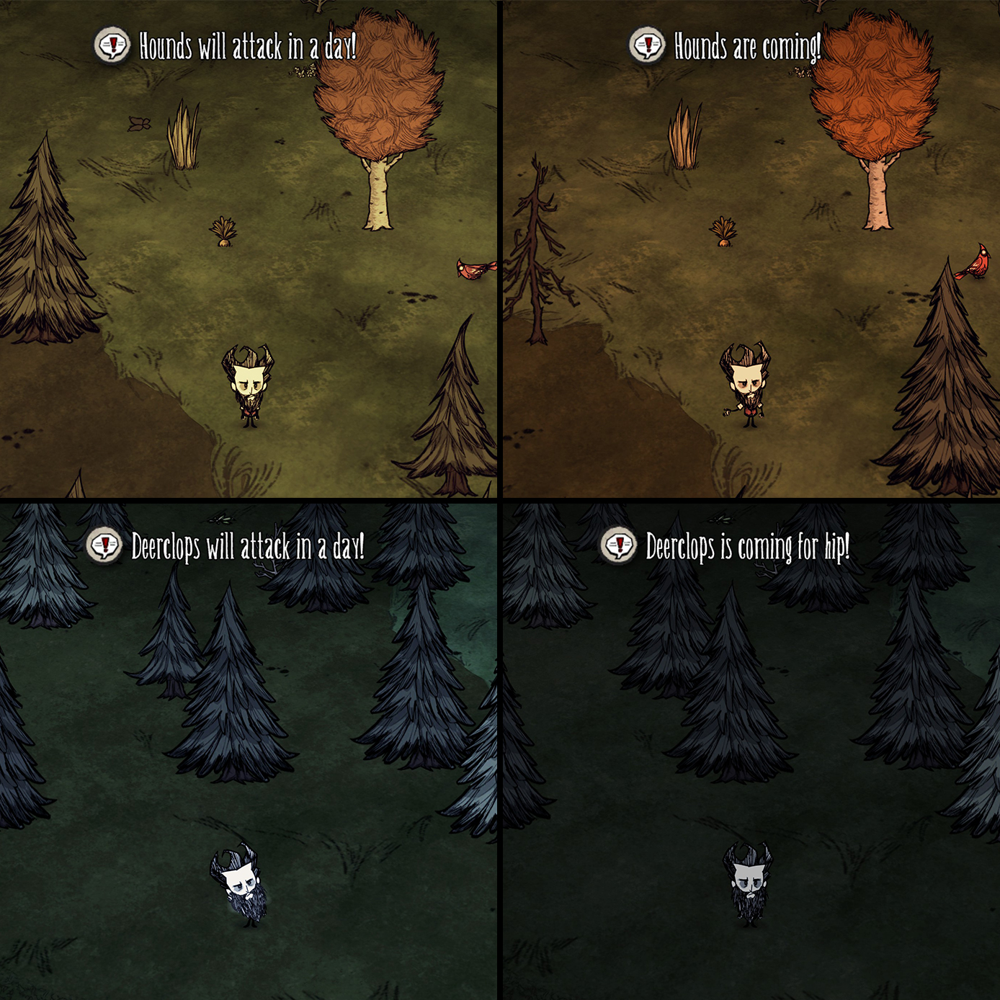

# Don't Panic

Alerts players by text against season boss and hound/worm attacks.

Only players near the target player will hear the warning sound from Deerclops and Bearger. So, this mod makes your life easier if you play with a friend next to you has speakers muted.

Supported monsters:
- Deerclops
- Bearger
- Hounds or worms

Options:
- Off: Disables announcement
- Default: Alerts only if monster is growling
- In a day: Alerts both before a day and when monster is growling

Links:
- Steam: https://steamcommunity.com/sharedfiles/filedetails/?id=2589904748
- GitHub: https://github.com/ibrahimpenekli/dst-dontpanic
